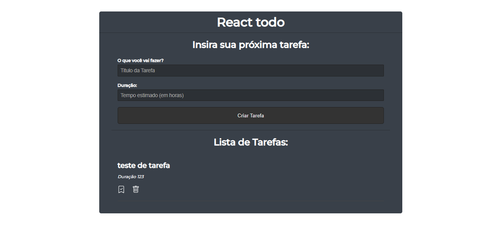

# React-Todo

## Sobre o Projeto

A atividade tem como objetivo didático, para o consumo de uma api em JSON-Server e estudo do básico em React, realizando um CRUD simples em forma de TODO.
A atividade foi feita como video do Matheus Battisti.

 

## Tecnologias utilizadas

- React
- CSS
- Markdown

 

## Confira:

[React TODO](https://github.com/AndreLuisConstantino/React-Todo)

[Vídeo Matheus Battisti](https://github.com/AndreLuisConstantino/React-Todo)

 

## Colaboradores

|                                                                                                             |                                                                                                                                                              |
| ----------------------------------------------------------------------------------------------------------- | ------------------------------------------------------------------------------------------------------------------------------------------------------------ |
|  |   |

